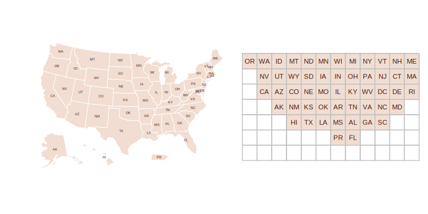

```{r, include=FALSE}
knitr::opts_chunk$set(
  collapse = TRUE,
  comment = "#>",
  fig.path = "man/figures/README-",
  out.width = "100%"
)
```

# gridmappr <a href="https://www.roger-beecham.com/gridmappr/"></a>

<!-- badges: start -->
[](https://github.com/rogerbeecham/gridmappr/actions/workflows/R-CMD-check.yaml)
<!-- badges: end -->


`gridmappr` is an R package that automates the process of generating [small multiple gridmap layouts](https://www.gicentre.net/smwg). Given a set of geographic point locations, it creates a grid (with stated *row, column* dimensions) and places each point in a grid cell such that the distance between points in geographic space and that within the grid space is minimised. The package is an R implementation of Jo Wood's Observable notebooks on [Linear Programming](https://observablehq.com/@jwolondon/hello-linear-programming) solvers and their application to the [Gridmap Allocation](https://observablehq.com/@jwolondon/gridmap-allocation?collection=@jwolondon/utilities) problem.

## Gridmap allocation using compactness with `points_to_grid()` 

Gridmaps, sometimes called tilemaps, are maps with spatial units allocated into a spatially-arranged grid of cells of regular size. Many gridmaps are generated manually, the widely used [LondonSquared](https://github.com/aftertheflood/londonsquared) layout of London boroughs for example. For automatic allocation of spatial units to grid cells, various constraints might be considered, see [Meulemans et al. 2017](https://www.gicentre.net/smwg) for a formal discussion and evaluation.

`gridmappr` allocates geographic point locations to grid cells such that the total of squared distances between geographic and grid locations is minimised. Each point is allocated to one grid cell only and a cell in the grid can contain no more than one geographic point. The grid must therefore contain at least as many cells as geographic points. 

The allocation is optimised with a *compactness* parameter, scaled between 0-1. A value of 0.5 attempts to place each point at its relative geographic position scaled within the bounds of the grid; a value of 1 attempts to place each point as close to the centre of the grid as possible; compactness closer to 0 allocates cells increasingly towards the edge of the grid.

The main allocation function to call is `points_to_grid()`. This will return grid cell positions (*row* and *column* identifiers) for a given set of geographic locations. It is paramerised with:

* `pts` A tibble of geographic points (*x*,*y*) to be allocated to a grid.
* `n_row` Maximum number of *rows* in grid.
* `n_col` Maximum number of *columns* in grid.
* `compactness` Optional parameter between `0` and `1` where `0` allocates towards edges, `0.5` preserves scaled geographic location and `1` allocates towards centre of grid. Default is `1` (compact cluster).
* `spacers` Optional list of grid cell locations defining grid location of fixed spacers which cannot be allocated points. Coordinates are in (`row`, `column`) order with origin `(1,1)` in bottom-left. Default is an empty list.

## Installation

You can install the development version of `gridmappr` from [GitHub](https://github.com/) with:

``` {r, install_github, eval=FALSE}
# install.packages("devtools")
devtools::install_github("rogerbeecham/gridmappr")
```

``` {r, load_packages, include = FALSE}
# For reproducing this document.
library(ggplot2)
library(ggforce)
library(tidyr)
library(dplyr)
library(purrr)
library(sf)
library(patchwork)
library(stringr)
library(gridmappr)
```


```{r hidden_options, include=FALSE}
# misc options
options(width = 90)
theme_set(theme_void())
```

## Example allocations

### London Boroughs

For generating a gridmap layout of 33 London boroughs, we first try an 8x8 regular grid.

* `n_row` Set to 8
* `n_col` Set to 8
* `compactness` Set to .6, attempting to preserve the geographic layout with a degree of compactness around the grid centre.

```{r, lb-no-spacers, eval=FALSE}
n_row <- 8
n_col <- 8
pts <- london_boroughs |>
  st_drop_geometry() |>
  select(area_name, x = easting, y = northing)
solution <- points_to_grid(pts, n_row, n_col, .6)
```

``` {r, lb-no-spacers-plot, eval=FALSE, echo=FALSE}
gridmap <- make_grid(london_boroughs, n_row, n_col) |>
  left_join(solution) |>
  ggplot() +
  geom_sf(fill = "transparent", colour = "#EEEEEE", linewidth = .6) +
  geom_text(aes(x = x, y = y, label = str_extract(area_name, "^.{3}")), size = 4, colour = "#451C14")
realmap <- london_boroughs |>
  ggplot() +
  geom_sf(fill = "#F1DDD1", colour = "#ffffff", linewidth = .6) +
  geom_text(aes(x = easting, y = northing, label = word(area_name, 1)), size = 2, colour = "#451C14")
realmap + gridmap
```

``` {r, include=FALSE, eval=FALSE}
plot <- realmap + gridmap + plot_layout(widths = c(1.2, 1))
ggsave(filename = here("man", "figures", "lb-no-spacers.svg"), plot = plot, width = 8, height = 5)
```


`gridmappr` allows for spacers (light grey) to be specified: grid cells that further constrain the distribution by not allowing points to be allocated to them. Adding some targeted spacers, we can get close to the [LondonSquared](https://github.com/aftertheflood/londonsquared) layout.


```{r, lb-spacers, eval=FALSE}
n_row <- 7
n_col <- 8
spacers <- list(
  c(1, 3), c(1, 5), c(1, 6),
  c(2, 2), c(2, 7),
  c(3, 1),
  c(6, 1), c(6, 2), c(6, 7), c(6, 8),
  c(7, 2), c(7, 3), c(7, 4), c(7, 6), c(7, 7)
)
pts <- london_boroughs |>
  st_drop_geometry() |>
  select(area_name, x = easting, y = northing)
solution <- points_to_grid(pts, n_row, n_col, 1, spacers)
```

``` {r, lb-spacers-plot, eval=FALSE, echo=FALSE}
gridmap <- make_grid(london_boroughs, n_row, n_col) |>
  left_join(solution) |>
  ggplot() +
  # geom_sf(data = lon_geogs |> filter(type=="real"), fill="#F1DDD1", colour="#FFFFFF", linewidth = .3) +
  geom_sf(fill = "transparent", colour = "#bdbdbd", linewidth = .2) +
  geom_sf(
    data = . %>% inner_join(spacers |> map_df(~ bind_rows(row = .x[1], col = .x[2]))),
    colour = "#EEEEEE", linewidth = 0, fill = "#bdbdbd", alpha=.2,
  ) +
  geom_sf(data = . %>% summarise(), fill = "transparent", colour = "#ffffff", linewidth = .4) +
  geom_text(aes(x = x, y = y, label = str_extract(area_name, "^.{3}")), size = 3.5, colour = "#451C14", alpha=.9, hjust=.5) #+
  theme(plot.background = element_rect(size=.2))


gridmap_comb <- make_grid(london_boroughs, n_row, n_col) |>
  left_join(solution) |>
  ggplot() +
  geom_sf(data = lon_geogs |> filter(type=="real"), fill="#EEEEEE", colour="#FFFFFF", linewidth = .3) +
  geom_sf(fill = "transparent", colour = "#bdbdbd", linewidth = .1) +
  # geom_sf(
  #   data = . %>% inner_join(spacers |> map_df(~ bind_rows(row = .x[1], col = .x[2]))),
  #   colour = "#EEEEEE", linewidth = 0, fill = "#bdbdbd", alpha=.2,
  # ) +
    geom_sf(data = . %>% summarise(), fill = "transparent", colour = "#ffffff", linewidth = .4) +
   geom_sf(data = . %>% filter(!is.na(area_name)), fill = "transparent", colour = "#bdbdbd", linewidth = .4) +
    ggforce::geom_bezier0(data = trajectories, aes(x = x, y = y, group = bor_name), colour = "#451C14", linewidth = .4, alpha=.5) +
  geom_text(aes(x = x+3000, y = y-1500, label = str_extract(area_name, "^.{3}")), size = 3.5, colour = "#451C14", alpha=.9, hjust=1)

  
lon_geogs <- bind_rows(
  london_boroughs |> mutate(type = "real") |> select(area_name, x = easting, y = northing, type),
  grid |> left_join(solution) |> mutate(type = "grid") |> select(area_name, x, y, type, geometry = geom)
)

trajectories <- lon_geogs |>
  st_drop_geometry() |>
  filter(!is.na(area_name)) |>
  pivot_wider(names_from = type, values_from = c(x, y)) |>
  mutate(bor_name = area_name) |>
  nest(data = c(area_name, x_real, y_real, x_grid, y_grid)) |>
  mutate(
    trajectory = map(data, ~ get_trajectory(.x$x_real, .x$y_real, .x$x_grid, .x$y_grid, .x$ward_name))
  ) |>
  select(trajectory, bor_name) |>
  unnest(cols = trajectory)

displacement <- ggplot() +
  geom_sf(data = lon_geogs |> mutate(type = factor(type, levels = c("real", "grid"))), aes(fill = type, colour = type), linewidth = .3) +
  ggforce::geom_bezier0(data = trajectories, aes(x = x, y = y, group = bor_name), colour = "#451C14", linewidth = .2) +
  scale_fill_manual(values = c("#F1DDD1", "transparent"), guide = "none") +
  scale_colour_manual(values = c("#FFFFFF", "#d9d9d9"), guide = "none")

plot <- gridmap + map_bubble + od_map + plot_layout(widths = c(.6,.7,1))

layout <- "
AADDD
AADDD
AADDD
BBDDD
BBEEE
BBEEE
CCEEE
CCEEE
CCEEE
"
plot <- realmap + gridmap + gridmap_comb + map_bubble + od_map + plot_layout(design=layout) & theme(plot.background = element_rect(size=.1))

plot <- (realmap / gridmap / gridmap_comb) | (map_bubble / od_map) + plot_layout(widths = c(.1,1)) & theme(plot.background = element_rect(size=.1))

ggsave(filename = here("man", "figures", "teaser.svg"), plot = plot, width = 12, height = 9)
```

``` {r, include=FALSE, eval=FALSE}
plot <- realmap + gridmap + plot_layout(widths = c(1, 1))
ggsave(filename = here("man", "figures", "lb-spacers.svg"), plot = plot, width = 8, height = 5)
```


### US States

There are other instances where some manual control over the allocation is desirable -- including Alaska, Hawaii and Puerto Rico in the grid of US states for example.

```{r, us-no-spacers, eval=FALSE}
n_row <- 7
n_col <- 12
pts <- us_states |>
  st_drop_geometry() |>
  select(STUSPS, x, y)
solution <- points_to_grid(pts, n_row, n_col, .8)
```

``` {r, us-no-spacers-plot, eval=FALSE, echo=FALSE}
gridmap <- make_grid(us_states, n_row, n_col) |>
  left_join(solution) |>
  ggplot() +
  geom_sf(fill = "transparent", colour = "#EEEEEE", linewidth = .6) +
  geom_text(aes(x = x, y = y, label = STUSPS), size = 4, colour = "#451C14") +
  theme_void()
realmap <- us_states |>
  ggplot() +
  geom_sf(fill = "#F1DDD1", colour = "#ffffff", linewidth = .4) +
  geom_text(aes(x = x, y = y, label = STUSPS), size = 2, colour = "#451C14") +
  theme_void()
realmap + gridmap
```

``` {r, include=FALSE, eval=FALSE}
plot <- realmap + gridmap + plot_layout(widths = c(1.2, 1))
ggsave(filename = here("man", "figures", "us-no-spacers.svg"), plot = plot, width = 10, height = 5)
```



Again this can be addressed by judiciously inserting spacers.

```{r, us-spacers, eval=FALSE}
n_row <- 7
n_col <- 12
spacers <- list(
  c(4, 2), c(4, 3),
  c(3, 5), c(3, 4), c(3, 3), c(3, 12), c(3, 11),
  c(2, 4), c(2, 5), c(2, 6), c(2, 7), c(2, 8)
)
pts <- us_states |>
  st_drop_geometry() |>
  select(STUSPS, x, y)
solution <- points_to_grid(pts, n_row, n_col, .9, spacers)
```

``` {r, us-spacers-plot, eval=FALSE, echo=FALSE}
gridmap <- make_grid(us_states, n_row, n_col) |>
  left_join(solution) |>
  ggplot() +
  geom_sf(fill = "transparent", colour = "#EEEEEE", linewidth = .6) +
  geom_sf(
    data = . %>% inner_join(spacers |> map_df(~ bind_rows(row = .x[1], col = .x[2]))),
    colour = "#EEEEEE", linewidth = .6, fill = "#FAFAFA",
  ) +
  geom_text(aes(x = x, y = y, label = STUSPS), size = 4, colour = "#451C14") +
  theme_void()
realmap + gridmap
```


``` {r, include=FALSE, eval=FALSE}
plot <- realmap + gridmap + plot_layout(widths = c(1.2, 1))
ggsave(filename = here("man", "figures", "us-spacers.svg"), plot = plot, width = 10, height = 5)
```


### Leicestershire Wards 

Geographies with 'holes' are a particular challenge for grid layouts. By setting the compactness to zero, allocations are pushed to the edge of the grid, preserving the internal space containing the separate City of Leicester.


```{r, leics, eval=FALSE}
n_row <- 14
n_col <- 14
pts <- leics_wards |>
  st_drop_geometry() |>
  select(ward_name, x = easting, y = northing)
solution <- points_to_grid(pts, n_row, n_col, 0)
```

``` {r, leics-plot, eval=FALSE, echo=FALSE}
gridmap <- make_grid(leics_wards, n_row, n_col) |>
  left_join(solution) |>
  ggplot() +
  geom_sf(fill = "transparent", colour = "#EEEEEE", linewidth = .6) +
  geom_sf(
    data = . %>% inner_join(spacers |> map_df(~ bind_rows(row = .x[1], col = .x[2]))),
    colour = "#EEEEEE", linewidth = .6, fill = "#FAFAFA",
  ) +
  geom_text(aes(x = x, y = y, label = str_extract(ward_name, "^.{3}")), size = 4, colour = "#451C14") +
  theme_void()
realmap <- leics_wards |>
  ggplot() +
  geom_sf(fill = "#F1DDD1", colour = "#ffffff", linewidth = .4) +
  geom_text(aes(x = easting, y = northing, label = str_extract(ward_name, "^.{3}")), size = 2, colour = "#451C14") +
  theme_void()
realmap + gridmap
```

``` {r, include=FALSE, eval=FALSE}
plot <- realmap + gridmap + plot_layout(widths = c(1.2, 1))
ggsave(filename = here("man", "figures", "leics.svg"), plot = plot, width = 12, height = 6)
```


``` {r, include=FALSE, eval=FALSE}
devtools::install_github("rogerbeecham/odvis")
library(odvis)

gridmap <- make_grid(leics_wards, n_row, n_col) |>
  left_join(solution)

leics_geogs <- bind_rows(
  leics_wards |> mutate(type = "real") |> select(ward_name, x = easting, y = northing, type),
  gridmap |> mutate(type = "grid") |> select(ward_name, x, y, type, geometry = geom)
)

# Get trajectories grid
trajectories <- leics_geogs |>
  st_drop_geometry() |>
  filter(!is.na(ward_name)) |>
  pivot_wider(names_from = type, values_from = c(x, y)) |>
  mutate(id = row_number()) |>
  nest(data = c(ward_name, x_real, y_real, x_grid, y_grid)) |>
  mutate(
    trajectory = map(data, ~ get_trajectory(.x$x_real, .x$y_real, .x$x_grid, .x$y_grid, .x$ward_name))
  ) |>
  select(trajectory) |>
  unnest(cols = trajectory)

plot <- ggplot() +
  geom_sf(data = leics_geogs, aes(fill = type, colour = type), linewidth = .4, alpha = .7) +
  ggforce::geom_bezier0(data = trajectories, aes(x = x, y = y, group = od_pair), colour = "#451C14", linewidth = .2) +
  scale_fill_manual(values = c("#FFFFFF", "#F1DDD1"), guide = "none") +
  scale_colour_manual(values = c("#d9d9d9", "#FFFFFF"), guide = "none") +
  theme_void()

ggsave(filename = here("man", "figures", "leics-displace.svg"), plot = plot, width = 8.5, height = 8.5)
```


## Example Uses

* [Beecham et al. 2021](https://eprints.whiterose.ac.uk/172944/) 'On the Use of ‘Glyphmaps’ for Analysing the Scale and Temporal Spread of COVID-19 Reported Cases', *ISPRS International Journal of Geo-Information*, 10(4), pp. 213--.

* [Beecham and Slingsby 2019](https://journals.sagepub.com/doi/10.1177/0308518X19850580) 'Characterising labour market self-containment in London with geographically arranged small multiples', *Environment and Planning A: Economy and Space*, 51(6), pp. 1217--1224. 

* [Wood et al. 2012](https://www.gicentre.net/featuredpapers) 'BallotMaps: Detecting name bias in alphabetically ordered ballot papers', *IEEE Transactions on Visualization and Computer Graphics*, 17(12), pp. 2384--2391.


