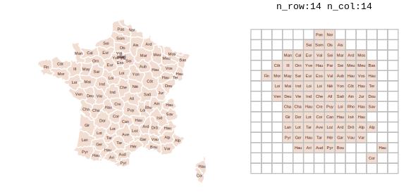

# gridmappr <a href="https://www.roger-beecham.com/gridmappr/"></a>

<!-- badges: start -->

[](https://github.com/rogerbeecham/gridmappr/actions/workflows/R-CMD-check.yaml)
[](https://doi.org/10.5281/zenodo.16878384)

<!-- badges: end -->


`gridmappr` is an R package that automates the process of generating
[small multiple gridmap layouts](https://www.gicentre.net/smwg). Given a
set of geographic point locations, it creates a grid with stated *row,
column* dimensions, and places each point in a grid cell such that the
distance between points in geographic space and that within the grid
space is minimised. The package is an R implementation of Jo Wood’s
Observable notebooks on [Linear
Programming](https://observablehq.com/@jwolondon/hello-linear-programming)
solvers and their application to the [Gridmap
Allocation](https://observablehq.com/@jwolondon/gridmap-allocation?collection=@jwolondon/utilities)
problem.

## Gridmap allocation using compactness with `points_to_grid()`

Gridmaps, sometimes called tilemaps, are maps with spatial units
allocated into a spatially-arranged grid of cells of regular size. Many
gridmaps are generated manually, the widely used
[LondonSquared](https://github.com/aftertheflood/londonsquared) layout
of London boroughs for example. For automatic allocation of spatial
units to grid cells, various constraints might be considered, see
[Meulemans et al. 2017](https://www.gicentre.net/smwg) for a formal
discussion and evaluation.

`gridmappr` allocates geographic point locations to grid cells such that
the total of squared distances between geographic and grid locations is
minimised. Each point is allocated to one grid cell only and a cell in
the grid can contain no more than one geographic point. The grid must
therefore contain at least as many cells as geographic points.

The allocation is optimised with a *compactness* parameter, scaled
between 0-1. A value of 0.5 attempts to place each point at its relative
geographic position scaled within the bounds of the grid; a value of 1
attempts to place each point as close to the centre of the grid as
possible; compactness closer to 0 allocates cells increasingly towards
the edge of the grid.

The main allocation function to call is `points_to_grid()`. This will
return grid cell positions (*row* and *column* identifiers) for a given
set of geographic locations. It is paramerised with:

- `pts` A tibble of geographic points (*x*,*y*) to be allocated to a
  grid.
- `n_row` Maximum number of *rows* in grid.
- `n_col` Maximum number of *columns* in grid.
- `compactness` Optional parameter between `0` and `1` where `0`
  allocates towards edges, `0.5` preserves scaled geographic location
  and `1` allocates towards centre of grid. Default is `1` (compact
  cluster).
- `spacers` Optional list of grid cell locations defining grid location
  of fixed spacers which cannot be allocated points. Coordinates are in
  (`row`, `column`) order with origin `(1,1)` in bottom-left. Default is
  an empty list.

## Installation

You can install the development version of `gridmappr` from
[GitHub](https://github.com/) with:

``` r
# install.packages("devtools")
devtools::install_github("rogerbeecham/gridmappr")
```

## Example allocations

### French Départements

For generating a gridmap layout of France’s 96 départements, first try
some candidate grid configurations. Remembering that any grid must
contain at least as many cells as spatial units, grids with 10x10, 12x12
and 14x14 are trialed:

- `n_row` Set to 10, 12, 14
- `n_col` Set to 10, 12, 14
- `compactness` Set to .6, attempting to preserve the geographic layout
  with a degree of compactness around the grid centre.

Notice that the smaller the grid dimensions, the more graphic space we
have for encoding data, at the expense of spatial precision; the larger
the grid dimensions, the closer that layout approximates to real
geography, at the expense of graphical space.

``` r
# Create df of point locations.
pts <- france_deps |> st_drop_geometry() |>
  select(area_name = name, x, y)

# Create gridmap layout.
solution <- points_to_grid(pts, n_row=10, n_col=10, compactness = .6)
```


``` r
# Create gridmap layout,.
solution <- points_to_grid(pts, n_row=12, n_col=12, compactness = .6)
```


``` r
# Create gridmap layout.
solution <- points_to_grid(pts, n_row=14, n_col=14, compactness = .6)
```



After some exploration, a 13x12 grid, seems to provide a reasonable
balance between graphic space and geographic context (shape and
adjacency). However, that layout implies that Corsica is contiguous with
mainland France. At this point, it is worth adding *spacers* – grid
cells that further constrain the distribution by not allowing points to
be allocated to them. Spacers are defined as a list in `(row, column)`
order with the origin `(1,1)` in bottom-left. To ensure Corsica is
separated from mainland France, the first three rows from the 11th
column and first two from the 10th column are excluded.

``` r
# Spacers to separate Corsica from mainland.
spacers <- list(
  c(1, 11), c(2, 11), c(3, 11), c(2,10), c(1,10)
)
# Point centroids for real départements.
pts <- france_deps |>
  st_drop_geometry() |>
  select(area_name = name, x = x, y = y)

solution <- points_to_grid(pts, 13, 12, .6, spacers)
```


### US States

There are of course other well-known geographies where some manual
control over the allocation is desirable. In a gridmap of the US, for
example, separating Alaska, Hawaii and Puerto Rico.

``` r
# Grid dimensions.
n_row <- 7
n_col <- 12
# Point centroids for US states.
pts <- us_states |>
  st_drop_geometry() |>
  select(area_name = STUSPS, x, y)
# Derive layout solution.
solution <- points_to_grid(pts, n_row, n_col, .8)
```


Again this can be addressed by judiciously inserting spacers.

``` r
# Grid dimensions.
n_row <- 7
n_col <- 12
# Spacers to separate non-contiguous states from mainland.
spacers <- list(
  c(4, 2), c(4, 3),
  c(3, 5), c(3, 4), c(3, 3), c(3, 12), c(3, 11),
  c(2, 4), c(2, 5), c(2, 6), c(2, 7), c(2, 8),
  c(1, 6)
)
# Point centroids for US states.
pts <- us_states |>
  st_drop_geometry() |>
  select(area_name = STUSPS, x, y)
# Derive layout solution.
solution <- points_to_grid(pts, n_row, n_col, .9, spacers)
```


### Leicestershire Wards

Geographies with ‘holes’ are a particular challenge for grid layouts. In
the example below, *compactness* is set to zero, meaning that
allocations are pushed to the edge of the grid, preserving the internal
space containing the separate City of Leicester.

``` r
# Grid dimensions.
n_row <- 14
n_col <- 14
# Point centroids for Leicestershire wards.
pts <- leics_wards |>
  st_drop_geometry() |>
  select(area_name = ward_name, x = easting, y = northing)
# Derive layout solution.
solution <- points_to_grid(pts, n_row, n_col, 0)
```


## Example Uses

- Beecham, R., Dykes, J., Hama, L. and Lomax, N. (2021) ‘On the Use of
  ‘Glyphmaps’ for Analysing the Scale and Temporal Spread of COVID-19
  Reported Cases’, *ISPRS International Journal of Geo-Information*,
  10(4), pp. 213–. doi:
  [10.3390/ijgi10040213](https://doi.org/10.3390/ijgi10040213).

- Beecham, R. and Slingsby, A. (2019) ‘Characterising labour market
  self-containment in London with geographically arranged small
  multiples’, *Environment and Planning A: Economy and Space*, 51(6),
  pp. 1217–1224. doi:
  [10.1177/0308518X19850580](https://journals.sagepub.com/doi/10.1177/0308518X19850580).

- Wood, J., Badawood, D., Dykes, J. and Slingsby, A. (2012) ‘BallotMaps:
  Detecting name bias in alphabetically ordered ballot papers’, *IEEE
  Transactions on Visualization and Computer Graphics*, 17(12),
  pp. 2384–2391. doi:
  [10.1109/TVCG.2011.174](https://doi.org/10.1109/TVCG.2011.174).
