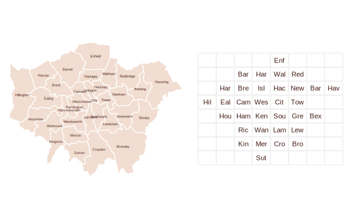
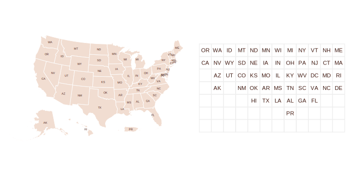
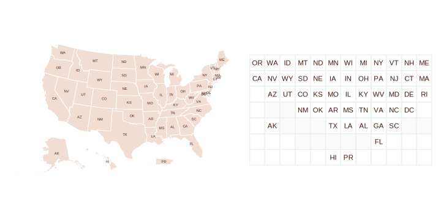
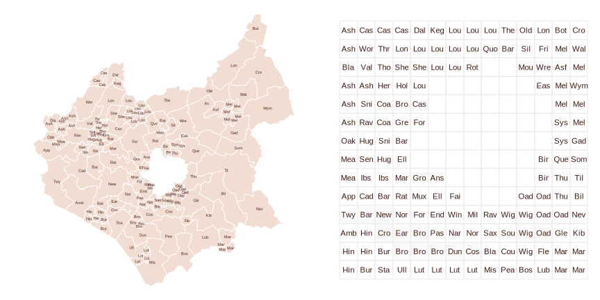

```{r, include = FALSE}
knitr::opts_chunk$set(
  collapse = TRUE,
  comment = "#>"
)
if (capabilities("cairo") && Sys.info()[['sysname']] != "Darwin") {
  knitr::opts_chunk$set(
    dev = "png",
    dev.args = list(type = "cairo")
  )
}
```


## Introduction
  
This vignette describes the process of generating gridmap layouts in `gridmappr`. Given a set of geographic point locations, `gridmappr` creates a grid (with stated *row*, *column* dimensions) and places each point in a grid cell such that the distance between points in geographic space and that within the grid space is minimised. After exploring various gridmap arrangements, this vignette demonstrates how those maps can be plotted for  analysis: building up a polygon file for grid layout solutions to encode them as thematic maps and showing how geographically-arranged charts can be created using the allocation and with standard calls to `ggplot2`. 

`gridmappr` is an R implementation of Jo Wood's Observable notebooks on [Linear Programming](https://observablehq.com/@jwolondon/hello-linear-programming) solvers and their application to the [Gridmap Allocation](https://observablehq.com/@jwolondon/gridmap-allocation?collection=@jwolondon/utilities) problem.

## Setup

The following libraries are required to run this vignette:

```{r setup, message = FALSE, warning = FALSE}
library(ggplot2)
library(dplyr)
library(sf)
library(stringr)
library(gridmappr)

theme_set(theme_void())
```


## Generate allocation with `points_to_grid()` 

The main allocation function in `gridmappr` is `points_to_grid()`.  This will return grid cell positions (*row* and *column* identifiers) for a given set of geographic locations. It is paramerised with:

* `pts` A tibble of geographic points (*x*,*y*) to be allocated to a grid.
* `n_row` Maximum number of *rows* in grid.
* `n_col` Maximum number of *columns* in grid.
* `compactness` Optional parameter between `0` and `1` where `0` allocates towards edges, `0.5` preserves scaled geographic location and `1` allocates towards centre of grid. Default is `1` (compact cluster).
* `spacers` Optional list of grid cell locations defining grid location of fixed spacers which cannot be allocated points. Coordinates are in (`row`, `column`) order with origin `(1,1)` in bottom-left. Default is an empty list.


### London Boroughs

For generating a gridmap layout of 33 London boroughs, we try an 8x8 regular grid.

* `n_row` Set to 8
* `n_col` Set to 8
* `compactness` Set to .6, attempting to preserve the geographic layout with a degree of compactness around the grid centre.

```{r, lb-no-spacers, eval=FALSE}
n_row <- 8
n_col <- 8
pts <- london_boroughs |>
  st_drop_geometry() |>
  select(area_name, x = easting, y = northing)
solution <- points_to_grid(pts, n_row, n_col, compactness = .6)
```

```{r out.width = '100%', echo = FALSE}

```


`gridmappr` allows for spacers (light grey) to be specified: grid cells that further constrain the distribution by not allowing points to be allocated to them. Adding some targeted spacers, we can get close to the [LondonSquared](https://github.com/aftertheflood/londonsquared) layout.


```{r, lb-spacers, eval=FALSE}
n_row <- 7
n_col <- 8
spacers <- list(
  c(1, 3), c(1, 5), c(1, 6),
  c(2, 2), c(2, 7),
  c(3, 1),
  c(6, 1), c(6, 2), c(6, 7), c(6, 8),
  c(7, 2), c(7, 3), c(7, 4), c(7, 6), c(7, 7)
)
pts <- london_boroughs |>
  st_drop_geometry() |>
  select(area_name, x = easting, y = northing)
solution <- points_to_grid(pts, n_row, n_col, compactness = 1, spacers)
```


```{r out.width = '100%', echo = FALSE}
knitr::include_graphics("img/lb-spacers.svg")
```


### US States

There are other instances where some manual control over the allocation is desirable -- including Alaska, Hawaii and Puerto Rico in the grid of US states for example.

```{r, us-no-spacers, eval=FALSE}
n_row <- 7
n_col <- 12
pts <- us_states |>
  st_drop_geometry() |>
  select(STUSPS, x, y)
solution <- points_to_grid(pts, n_row, n_col, compactness = .8)
```

```{r out.width = '100%', echo = FALSE}

```

Again this can be addressed by judiciously inserting spacers.

```{r, us-spacers, eval=FALSE}
n_row <- 7
n_col <- 12
spacers <- list(
  c(4, 2), c(4, 3),
  c(3, 5), c(3, 4), c(3, 3), c(3, 12), c(3, 11),
  c(2, 4), c(2, 5), c(2, 6), c(2, 7), c(2, 8)
)
pts <- us_states |>
  st_drop_geometry() |>
  select(STUSPS, x, y)
solution <- points_to_grid(pts, n_row, n_col, compactness = .9, spacers)
```

```{r out.width = '100%', echo = FALSE}

```


### Leicestershire Wards 

Geographies with 'holes' are a particular challenge for grid layouts. By setting the compactness to zero, allocations are pushed to the edge of the grid, preserving the internal space containing the separate City of Leicester.


```{r, leics, eval=FALSE}
n_row <- 14
n_col <- 14
pts <- leics_wards |>
  st_drop_geometry() |>
  select(ward_name, x = easting, y = northing)
solution <- points_to_grid(pts, n_row, n_col, compactness = 0)
```

```{r out.width = '100%', echo = FALSE}

```


## Building gridded polygon objects with `make_grid()`

Once a layout has been generated, you may wish to create a corresponding polygon object so that the layout can be mapped. This can be achieved with `make_grid()`. 

The function takes an [`sf`](https://r-spatial.github.io/sf/index.html) data frame of 'real' geography and returns an `sf` data frame representing a grid, with variables identifying *column* and *row* IDs (bottom left is origin) and geographic centroids of grid squares. The gridded object can then be joined on a gridmap solution returned from (`points_to_grid()`) in order to create an object in which each grid cell corresponds to a gridmap allocation position.


`make_grid()` takes the following arguments:

* `sf_file` An sf object to pass grid over.
* `n_row` Number of rows in grid.
* `n_col` Number of columns in grid.


### Create layout solution

First we generate a gridmap layout solution (named `solution`) for London boroughs, including spacers to approximate the LondonSquared layout.

```{r, lb-layout-grid}
n_row <- 7
n_col <- 8
spacers <- list(
  c(1, 3), c(1, 5), c(1, 6),
  c(2, 2), c(2, 7),
  c(3, 1),
  c(6, 1), c(6, 2), c(6, 7), c(6, 8),
  c(7, 2), c(7, 3), c(7, 4), c(7, 6), c(7, 7)
)
pts <- london_boroughs |>
  st_drop_geometry() |>
  select(area_name, x = easting, y = northing)
solution <- points_to_grid(pts, n_row, n_col, compactness = 1, spacers)
```

### Create grid object

Next, create the gridded polygon object using `make_grid()`. Supply the  `sf` file of London borough polygons (`london_boroughs`, comes with `gridmappr`) and the dimensions of the grid, the same as those used to generate the layout solution. 

``` {r, lb-grid}
grid <- make_grid(london_boroughs, n_row, n_col)
```


### Plot grid object using `geom_sf()`

Cells of the grid that have a borough allocated to them can then be isolated by joining the gridded object (`grid`) on the layout `solution`. 


Below we plot the gridded sf object using `ggplot2`'s [`geom_sf`](https://ggplot2.tidyverse.org/reference/ggsf.html) geom. 

``` {r, lb-mapgrid, warning = FALSE}
grid |>
  left_join(solution) |> mutate(is_alloc=!is.na(area_name)) |> 
  ggplot() +
  geom_sf(aes(fill = is_alloc), colour = "#EEEEEE", linewidth = .6) +
  geom_text(aes(x = x, y = y, label = str_extract(area_name, "^.{3}")), size = 4, colour = "#451C14") +
  scale_fill_manual(values = c("#ffffff", "#F1DDD1"), guide = "none")
```


