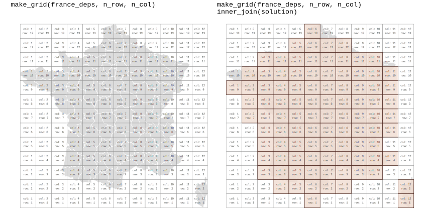
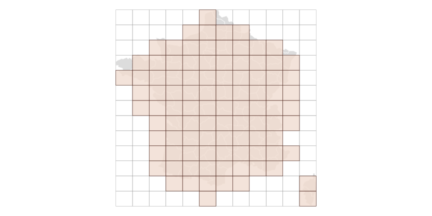
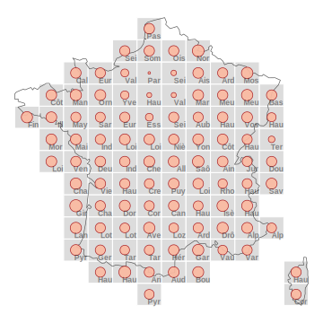
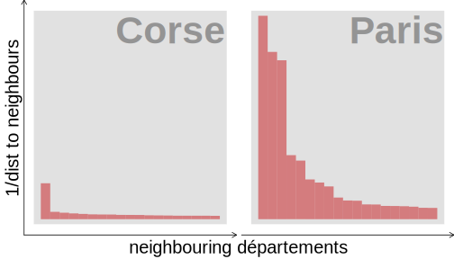
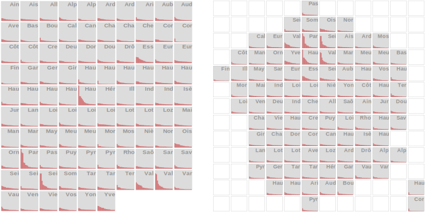
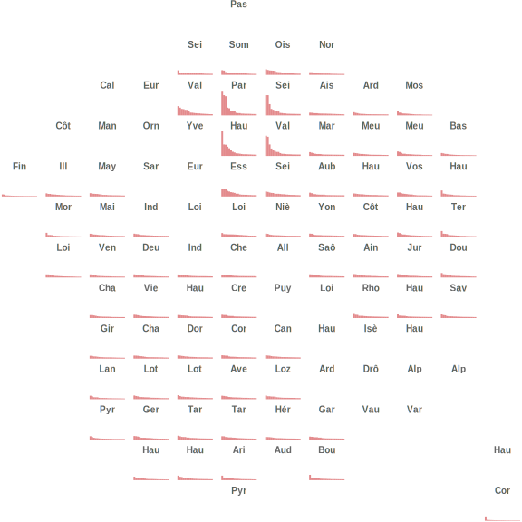

```{r, include = FALSE}
knitr::opts_chunk$set(
  fig.width = 8,
  fig.height = 5.25,
  collapse = TRUE,
  comment = "#>"
)
```

## Introduction

This article demonstrates how `gridmappr`-generated layouts can be used with standard ggplot2 to create different gridmap designs. Gridmaps are encoded: 

1. In the same way as thematic maps, using `geom_sf()`; 
2. As information-rich 'glyphmaps', using ggplot2's layered `geoms` and `facet_grid(row~col)`; 
3. As gridmap-arranged thematic maps, or [OD Maps](https://openaccess.city.ac.uk/id/eprint/537/), using `facet_grid(row~col)` together with `geom_sf()`. 

## Setup and data

The following libraries are required to run this article:

```{r setup, message = FALSE, warning = FALSE}
# Tidyverse
library(here)
library(ggplot2)
library(dplyr)
library(readr)
library(forcats)
library(tidyr)
library(stringr)
# Spatial
library(sf)
library(geosphere)
# Gridmaps
library(gridmappr)
# Alternatives
library(geofacet)

theme_set(theme_void())
```

The only dataset needed is the `simple features` file of the 96  départements in France (`france_deps`) that ships with `gridmappr`. Some of the graphics demonstrated do rely on a derived dataset from this file. In the code below, we create a full 'origin-destination' (OD) dataset for each  département pair (so 96^2 OD pairs), calculating the straight-line distance bewteen département centroids.


```{r data, message = FALSE, warning = FALSE, eval=FALSE}
# Département names and centroids that serve as "destinations".
dests <- france_deps |> 
  st_drop_geometry() |> select(-name_prefecture) |>  
   mutate(dests="dests") |> 
   select(dests, d_name=name, d_x=x, d_y=y) |> 
   nest(.by=dests)
# Calculate pairwise distancess between OD département pairs.
france_ods <- france_deps |> 
   st_drop_geometry() |> select(-name_prefecture) |>  
   mutate(origins="origins") |> 
   select(origins, o_name=name, o_x=x, o_y=y) |>
   mutate(dests=dests$data) |> 
   unnest(dests) |> 
   rowwise() |>
   # Calculate distance and express in kms.
   mutate(dep_dist=distHaversine(c(o_y, o_x), c(d_y, d_x))/1000) |>
   ungroup()
rm(dests)
```

## Generate allocation and build polygon object with `make_grid()`


The main function of `gridmappr`, `points_to_grid()`, is described in the top-level package description. The same parameterisation of that function is used here to achieve a reasonable allocation of French départements, with selected grid dimensions and spacers.

```{r, deps-allocation, eval=FALSE}
# Grid dimensions.
n_row <- 13
n_col <- 12
# Spacers to separate Corsica from mainland.
spacers <- list(
  c(1, 11), c(2, 11), c(3, 11), c(2,10), c(1,10)
)
# Point centroids for real départements.
pts <- france_deps |>
  st_drop_geometry() |>
  select(area_name = name, x = x, y = y)
# Derive layout solution.
solution <- points_to_grid(pts, n_row, n_col, .6, spacers)
```




Now a layout has been generated, we create a corresponding polygon object in order for the layout to be plotted. This can be achieved with `make_grid()`. The function takes an [`sf`](https://r-spatial.github.io/sf/index.html) data frame of 'real' geography and returns an `sf` data frame representing a grid, with variables identifying *column* and *row* IDs (bottom left is origin) and geographic centroids of grid squares. The gridded object can then be joined on a gridmap solution returned from `points_to_grid()` in order to create an object in which each grid cell corresponds to a gridmap allocation position.

`make_grid()` takes the following arguments:

* `sf_file` An sf object the grid is to be passed over.
* `n_row` Number of rows in grid.
* `n_col` Number of columns in grid.


``` {r, deps-grid, eval=FALSE}
# Pass a grid over real départements.
grid <- make_grid(france_deps, n_row, n_col)
```

Cells of the grid that have a département allocated to them are then isolated by joining the gridded object (`grid`) on the layout `solution`. Below the grid file is plotted using `ggplot2`'s [`geom_sf`](https://ggplot2.tidyverse.org/reference/ggsf.html) geom. 


``` {r, deps-grid-plot, eval=FALSE}
# Plot layout solution.
grid |> 
  left_join(solution) |> 
  ggplot() +
  # Draw original geog.
  geom_sf(data = france_deps, fill="#d9d9d9", colour="#FFFFFF", linewidth = .3, alpha=.9) +
  # Draw grid cell candidates.
  geom_sf(fill = "transparent", colour = "#969696", linewidth = .2) +
  # Draw grid cells allocated.
  geom_sf(data = . %>% filter(!is.na(area_name)), colour="#451C14", fill="#F1DDD1", linewidth = .3, alpha=.8) 
```





```{r, include=FALSE, eval=FALSE}
# Generate figure explaining grid and data strucuture.
grid_joined <- grid |> 
  left_join(solution) |> 
  ggplot() +
  geom_sf(data = france_deps, fill="#d9d9d9", colour="#FFFFFF", linewidth = .3, alpha=.9) +
  geom_sf(fill = "transparent", colour = "#969696", linewidth = .2) +
  geom_sf(data = . %>% filter(!is.na(area_name)), colour="#451C14", fill="#F1DDD1", linewidth = .3, alpha=.8) +
  geom_text(aes(x=x, y=y, label=paste0("col: ", col, "\nrow: ",row)), colour="#252525",
            alpha=0.8, size=2, show.legend=FALSE,
            hjust="center", vjust="middle", family="mono") +
  labs(title="make_grid(france_deps, n_row, n_col)\n inner_join(solution)") +
  theme(plot.title = element_text(hjust = 0, family="mono"))

grid_dem <- grid |> 
  ggplot() +
  geom_sf(data = france_deps, fill="#d9d9d9", colour="#FFFFFF", linewidth = .3, alpha=.9) +
  geom_sf(fill = "transparent", colour = "#969696", linewidth = .2) + 
  geom_text(aes(x=x, y=y, label=paste0("col: ", col, "\nrow: ",row)), colour="#252525",
            alpha=0.8, size=2, show.legend=FALSE,
            hjust="center", vjust="middle", family="mono") +
  labs(title="make_grid(france_deps, n_row, n_col)") +
  theme(plot.title = element_text(hjust = 0, family="mono"))

plot <- grid_dem + grid_joined

ggsave(filename = here("man", "figures", "france-grids.svg"), plot = plot, width = 12, height = 6)
```


## Gridmap as thematic map with `geom_sf()`

Since we have a simple features object for the layout with `make_grid()`, it is straightforward to generate thematic gridmaps using [`geom_sf()`](https://ggplot2.tidyverse.org/reference/ggsf.html) alongside ggplot2's standard `geom` layers and grammar. 

In the map below the perimeter of départements is encoded as proportional symbols with `geom_point()`, positioned at the grid centroid of the cells to which each département is assigned.



```{r, deps-bubble, eval=FALSE} 
# Find the cell size of grids -- for label positioning.
cell_size <- st_bbox(grid |> slice(1))
cell_width <- cell_size$xmax - cell_size$xmin  
cell_height <- cell_size$ymax - cell_size$ymin

# Plot as a proportional symbol map.
grid |>
  # Identify cells that form the layout.
  inner_join(solution) |> 
  # Record and attach the perimeter of each département.
  left_join(france_deps |> 
              mutate(perimeter=as.numeric(st_perimeter(geometry)/1000)) |> 
              st_drop_geometry() |> 
              select(name, perimeter), by=c("area_name"="name")) |> 
  ggplot() +
  # Plot grey cell background.
  geom_sf(fill="#d9d9d9", colour="#ffffff", linewidth=.5, alpha=.9) +
  # Plot real geography of France as an outline.
  geom_sf(data=france_deps |> mutate(is_corse=str_detect(name, "Corse")) |>
            group_by(is_corse) |> summarise(),
          fill="transparent", colour="#525252", linewidth=.3) +
  # Plot proportional symbols.
  geom_point(aes(x, y, size=perimeter), colour="#a50f15", fill="#fcbba1", pch=21, alpha=.9) +
  # Plot text labels in bottom right of grid cells.
  geom_text(aes(x=x+.48 *cell_width, y=y-.48*cell_height, 
                                           label=str_extract(area_name, "^.{3}")),
            colour="#252525", alpha=0.5, size=2, show.legend=FALSE, 
            hjust="right", vjust="bottom", face="Bold") +
  scale_size(guide="none")
```

A quick explanation of the ggplot2 spec:

1. *Data*: We join the gridded object (`grid`) on the layout `solution`, then on `france_deps`, a simple features file containing the real geographies of the départements.  In the `mutate()`, we calculate the perimeters from this file and then drop out the geometry. Note that we also record the size of each grid cell in the `grid` object -- this is to help with placing labels, and potentially other symbols or chart elements, on our map. 
2. *Encoding*: the proportional symbols are positioned at the centroids of département grid cells (`x`, `y`), sized according to `perimeter`.
3. *Marks*: `geom_point()` for proportional symbols and `geom_sf()` for grid outline and outline of the real geography of France. We want to collapse the outline separately for Corsica and to achieve this we use `group_by()` on a derived variable identifying départements that are on Corsica (`is_corse`).


```{r, include=FALSE, eval=FALSE}
cell_size <- st_bbox(grid |> slice(1))
cell_width <- cell_size$xmax - cell_size$xmin  
cell_height <- cell_size$ymax - cell_size$ymin  

plot <- grid |>
  inner_join(solution) |> 
  left_join(france_deps |> 
              mutate(perimeter=as.numeric(st_perimeter(geometry)/1000)) |> 
              st_drop_geometry() |> 
              select(name, perimeter), by=c("area_name"="name")) |> 
  mutate(area_label=gsub('\\b(\\pL)\\pL{1,}|.','\\U\\1', str_replace(area_name,"-", " "), perl = TRUE)) |> 
  ggplot() +
  geom_sf(fill="#d9d9d9", colour="#ffffff", linewidth=.5, alpha=.9) +
  #geom_point(aes(x, y, size=perimeter), colour="#451C14", fill="#F1DDD1", pch=21, alpha=.9) +
  geom_sf(data=france_deps |> mutate(is_corse=str_detect(name, "Corse")) |>
            group_by(is_corse) |> summarise(),
          fill="transparent", colour="#525252", linewidth=.3) +
   
  geom_point(aes(x, y, size=perimeter), colour="#a50f15", fill="#fcbba1", pch=21, alpha=.9) +
  geom_text(aes(x=x+.48*cell_width, y=y-.46*cell_height, 
                                           label=str_extract(area_name, "^.{3}")),
            colour="#252525", alpha=0.5, size=3, show.legend=FALSE, 
            hjust="right", vjust="bottom", fontface="bold") +
  scale_size(guide="none")

ggsave(filename = here("man", "figures", "france-bubble.svg"), plot = plot, width = 5, height = 5)
```


## Gridmap as geographically-arranged `geoms` with `facet_grid()`

In the example above, we render gridmaps in the same way as a thematic map. The gridded layout may resolve some of the occlusion were proportional symbols located in their real geographic position. However, we are not showing complex or multivariate structure, as is intended with gridmap arrangements.   

There are of course many interesting data that we *could* represent on French départements. In the graphics below, we show the 1D distribution in the inverse distance to the neighbouring départements of *Paris* and *Corse-du-Sud*. Not a terribly exciting statistic, but fine for this illustrative article. Paris has three  départements that are very close; *Corse-du-Sud* has one immediate neighbour on Corsica and many on the mainland that are some distance away.

{width=40%}

```{r, include=FALSE, eval=FALSE}
plot <- france_ods |> 
  left_join(solution, by=c("o_name"="area_name")) |> 
  rename(o_row=row, o_col=col) |> 
  left_join(solution, by=c("d_name"="area_name")) |> 
  rename(d_row=row, d_col=col) |> ungroup() |> 
  mutate(
    dep_dist=if_else(o_name==d_name,10^8,dep_dist),
    min_dist=min(dep_dist),
    dep_dist=min_dist/(dep_dist),
  ) |> 
  group_by(d_name) |> 
  arrange(desc(dep_dist)) |>
  mutate(rank=row_number(), is_focus=o_name==d_name) |>   
  filter(d_name %in% c("Paris", "Corse-du-Sud")) |> 
  
  ggplot() +
 
  geom_tile(
    data=. %>% filter(is_focus),
    aes(x = 10, y = .5),
    width=20.5, height=1.05,
    fill="#d9d9d9", colour="#ffffff", linewidth=.1, alpha=.8
  ) +
  geom_col(
    data = . %>% filter(rank<20),
    aes(x=rank, y=dep_dist), width=1, fill="#cb181d", alpha=.5) +
  geom_text(data=. %>% filter(o_name==d_name), aes(x=20, y=1,
                                                   label=str_extract(d_name, "^.{5}")),
            colour="#252525", alpha=0.4, size=15, show.legend=FALSE,
            hjust="right", vjust="top", fontface="bold") +
  facet_wrap(~d_name, nrow=1) +
  labs(y="1/dist to neighbours", x="neighbouring départements") +
  theme(
    axis.line = element_line(linewidth=.35, arrow=arrow(length = unit(0.2, "cm"))),
    strip.text.x = element_blank(), strip.text.y = element_blank(),
    axis.title.y = element_text(size=20, angle=90, margin = margin(r = 4, l = 4)), 
    axis.title.x = element_text(size=20, margin = margin(t = 4, b = 4)),
    axis.text = element_blank()
  )
ggsave(filename = here("man", "figures", "france-dist-comp.svg"), plot = plot, width = 7, height = 4)

plot_all <- france_ods |> 
  left_join(solution, by=c("d_name"="area_name")) |> 
  rename(d_row=row, d_col=col) |> ungroup() |> 
  mutate(
    dep_dist=if_else(o_name==d_name,10^8,dep_dist),
    min_dist=min(dep_dist),
    dep_dist=min_dist/(dep_dist),
  ) |> 
  group_by(d_name) |> 
  arrange(desc(dep_dist)) |>
  mutate(rank=row_number(), is_focus=o_name==d_name) |> ungroup() |> 
  
  ggplot() +
  
  geom_tile(
    data=. %>% filter(is_focus),
    aes(x = 10, y = .5),
    width=20, height=1,
    fill="#d9d9d9", colour="#ffffff", linewidth=.1, alpha=.9
  ) +
  geom_col(
    data = . %>% filter(rank<20),
    aes(x=rank, y=dep_dist), width=1, fill="#cb181d", alpha=.5) +
  geom_text(data=. %>% filter(o_name==d_name), aes(x=20, y=.95,
                                                   label=str_extract(d_name, "^.{3}")),
            colour="#252525", alpha=0.4, size=3.5, show.legend=FALSE,
            hjust="right", vjust="top", fontface="bold") +
  
  facet_wrap(~d_name, shrink=FALSE) +
  theme(
    panel.spacing=unit(-0.1, "lines"),
    axis.title.x=element_blank(),axis.title.y=element_blank(),
    strip.text.x = element_blank(), strip.text.y = element_blank(),
    plot.margin = margin(t = 0, r = 0, b = 0, l = 0, unit = "pt"),
    axis.line = element_blank(), 
    axis.text = element_blank()
  )

france_grid <- grid |>
  inner_join(solution)

plot_data <- france_ods |> 
  left_join(solution, by=c("d_name"="area_name")) |> 
  rename(d_row=row, d_col=col) |> ungroup() |> 
  mutate(
    dep_dist=if_else(o_name==d_name,10^8,dep_dist),
    min_dist=min(dep_dist),
    dep_dist=min_dist/(dep_dist),
  ) |> 
  group_by(d_name) |> 
  arrange(desc(dep_dist)) |>
  mutate(rank=row_number(), is_focus=o_name==d_name) |> ungroup()

plot_spat <-  plot_data |>  
  ggplot() +
  geom_tile(
    data=grid %>% st_drop_geometry()  %>%
      anti_join(france_grid) %>%
      mutate(d_col=col, d_row=row),
    aes(x = 10, y = .5), width=20, height=1,
    fill = "transparent", colour = "#969696", linewidth = .1
  ) +
  geom_tile(
    data=grid %>% st_drop_geometry()  %>% 
      inner_join(france_grid) %>% 
      mutate(d_col=col, d_row=row),
    aes(x = 10, y = .5),
    width=20, height=1,
    fill="#d9d9d9", colour="#969696", linewidth=.1, alpha=.9
  ) +
  geom_col(
    data = . %>% filter(rank<20),
    aes(x=rank, y=dep_dist), width=1, fill="#cb181d", alpha=.5) +
  geom_text(data=. %>% filter(o_name==d_name), aes(x=20, y=.95,
                                                   label=str_extract(d_name, "^.{3}")),
            colour="#252525", alpha=0.4, size=3.2, show.legend=FALSE,
            hjust="right", vjust="top", fontface="bold") +
  
  facet_grid(-d_row~d_col) +
  theme(
    panel.spacing=unit(-0, "lines"),
    axis.title.x=element_blank(),axis.title.y=element_blank(),
    strip.text.x = element_blank(), strip.text.y = element_blank(),
    plot.margin = margin(t = 0, r = 0, b = 0, l = 0, unit = "pt"),
    axis.line = element_blank(), 
    axis.text = element_blank()
  )
plot <- plot_all + plot_spacer() + plot_spat + plot_layout(widths=c(1,.1,1.1))

ggsave(filename = here("man", "figures", "france-dist-spat.svg"), plot = plot, width = 10, height = 5)
```


We can generate small multiple faceted plots of each of these, in standard ggplot2 using [faceting](https://ggplot2-book.org/facet.html). Eyeballing this full graphic, there are certain départements which must be in reasonably close proximity to one another (cells containing the longer bars). Using [facet_grid()](https://ggplot2-book.org/facet.html#facet-grid), we can effect a spatial arrangement of these plots. Doing so confirms what might have been expected: Paris is distinctive, subdividing into several départements that are close in geographic space.





```{r, deps-dist, eval=FALSE} 
plot_data <- france_ods |> 
  left_join(solution, by=c("d_name"="area_name")) |> 
  rename(d_row=row, d_col=col) |> ungroup() |> 
  mutate(
    dep_dist=if_else(o_name==d_name,10^8,dep_dist),
    min_dist=min(dep_dist),
    dep_dist=min_dist/(dep_dist),
  ) |> 
  group_by(d_name) |> 
  arrange(desc(dep_dist)) |>
  mutate(rank=row_number(), is_focus=o_name==d_name) |> ungroup() 

plot_data |> 
  ggplot() +
  # Draw background map tiles (equivalent to geom_sf()).
  geom_tile(
    data=grid %>% st_drop_geometry()  %>% 
      inner_join(france_grid) %>% 
      mutate(d_col=col, d_row=row),
    aes(x = 10, y = .5),
    width=20, height=1,
    fill="#d9d9d9", colour="#969696", linewidth=.1, alpha=.9
  ) +
  # Draw column charts.
  geom_col(
    data = . %>% filter(rank<21),
    aes(x=rank, y=dep_dist), width=1, fill="#cb181d", alpha=.5) +
  # Draw text labels for each département.
  geom_text(data=. %>% filter(o_name==d_name), aes(x=20, y=.95,
                                                   label=str_extract(d_name, "^.{3}")),
            colour="#252525", alpha=0.4, size=3.2, show.legend=FALSE,
            hjust="right", vjust="top", fontface="bold") +
  facet_grid(-d_row~d_col)
```

A quick explanation of the ggplot2 spec:

1. *Data*: A staging dataset (`plot_data`) is created. In order to bring in the `col` and `row` indexes for faceting as a grid, we join `france_ods` on the gridmap `solution` dataset, and on the 'destination' département, which are the larger reference cells in our gridmap -- the bars representing inverse distances to those département, we call 'origins'. In the mutate, we scale 1/distance between 0 and 1, using the minimum distance between any origin-destination département, after having recoded distances of 0 for départements of the same `origin-destination`. After grouping by these destinations, we rank 'origin' départements on their proximity (`rank`).   
2. *Encoding*: Bars whose length (`y=`) varies according to inverse distance and categorical position (`x=`) according to `rank` proximity to the 'destination' département.
3. *Marks*: `geom_col()` for the bars, with the top 20 most proximate 'origin' départements filtered; `geom_text()` for drawing 'destination' département labels.
4. *Facets*: `facet_grid()` with a slight hack on the row variable (`-row`) as gridmappr’s origin [*min-row*, *min-col*] is the bottom-left cell in the grid whereas for `facet_grid()` the origin is the top-left.


## Using gridmap allocations with ggplot2 extensions

For a very user-friendly way of drawing gridmaps from `gridmappr`-generated layouts, we are in the process of incporporating `gridmappr` into the excellent [`tmap`](https://r-tmap.github.io/tmap/) package.  

Although there are benefits to designing gridmaps within standard declarative ggplot2, for those preferring a slightly higher-level interface than demonstrated here, `gridmappr` generated layouts can also be used in [`geofacet`](https://hafen.github.io/geofacet/). Since `points_to_grid()` returns grid allocations in the same data structure as required by `geofacet`, this is reasonably straightforward. In the code below, we slightly reorganise the variables in the gridmap `solution` file and transpose the `row` column up-front, as was necessary with the `facet_grid()` example. This allocation (`grid_data`) is then supplied to `facet_geo()`. 

```{r plot-geofacet, eval=FALSE}
# Slight edits to solution dataset, as required by geofacet.
grid_data <- solution |> 
  mutate(
    # A code variable is required.
    code=row_number(),
    # Transpose row, due to inverse origin.
    row=((max(row)+min(row))-row),
    name=area_name
    ) |> 
  select(row, col, code, name) |> 
  # Cast name as factor and set levels, so that exactly match with plot_data.
  arrange(name) |> mutate(name=factor(name)) 

  
plot_data |> 
  select(o_name, d_name, dep_dist, rank, name=d_name) |> 
  filter(rank<21) |> 
  arrange(name) |> 
  # Cast name as factor and set levels, so that exactly match with grid_data.
  mutate(name=factor(name, levels=grid_data$name)) |> 
  ggplot() +
  # Draw column charts.
  geom_col(aes(x=rank, y=dep_dist), width=1, fill="#cb181d", alpha=.5) +
  # Call facet function and supply 'name' and the 'grid_data'. 
  facet_geo(~name, grid=grid_data, labeller = as_labeller(function(x) str_extract(x, "^.{3}"))) +
  theme(strip.text = element_text(face="bold", size=10, colour="#636363"))
```

```{r, include=FALSE, eval=FALSE}
ggsave(filename = here("man", "figures", "france-dist-geofacet.svg"), plot = plot, width = 8, height = 8)
```

{width=50%}

TODO: The data in some cells do not display. I've investiagted the most likely causes, so more detective work needed to fix this. 

## Gridmap as geographically arranged `geom_sfs` (OD Maps)

So far we have generated gridmap graphics as standard thematic maps using a polygon object and `geom_sf()`; and as geographically arranged plot objects (glyphmaps) with `facet_grid()`. Combining both approaches -- placing standard thematic maps with a further geographical arrangement (using `facet_grid()`) -- allows the creation of [OD Maps](https://openaccess.city.ac.uk/id/eprint/537/). With this map-within-map layout, we can encode distances to 'destination' départements not using bars, but with cells of 'origin' départements arranged geographically. 

 

```{r, include=FALSE, eval=FALSE}
# Store width and height of grid geography.
france_width <- bbox_grid$xmax - bbox_grid$xmin
france_height <- bbox_grid$ymax - bbox_grid$ymin

plot <- france_ods |> 
  left_join(solution, by=c("d_name"="area_name")) |> 
  rename(d_row=row, d_col=col) |> ungroup() |>
  
  left_join(solution, by=c("o_name"="area_name")) |> 
  rename(o_row=row, o_col=col) |> 
  
  mutate(is_focus=o_name==d_name) |> 
  
  # Uncomment to join on grid geographies.
  left_join(france_grid |> select(area_name, o_x=x, o_y=y), by=c("o_name"="area_name")) |> st_as_sf() |>
  
  # Uncomment to join on real geographies.
  # left_join(france_deps |> select(-c(x, y)) |> 
  #             left_join(france_grid |> st_drop_geometry(), by=c("name"="area_name")) 
  #           |> select(name), by=c("o_name"="name")) |> st_as_sf() |> 
  
  ggplot() +
  geom_tile(
    data=. %>% filter(is_focus),
    aes(x = bbox_grid$xmin + .51*france_width , y = bbox_grid$ymin + .51*france_height),
    width=1.02*france_width, height=1.02*france_height,
    fill="#d9d9d9", colour = "#969696", linewidth = 0, alpha=1
  ) +
  
  geom_tile(
    data=france_grid  %>% mutate(d_col=col, d_row=row) %>% st_drop_geometry(),
    aes(x = bbox_grid$xmin + .51*france_width , y = bbox_grid$ymin + .51*france_height),
    width=1.02*france_width, height=1.02*france_height,
    fill="transparent", colour = "#969696", linewidth = .15, alpha=.5
  ) +
  
  geom_sf(aes(fill = dep_dist), colour = "#969696", linewidth = 0.05, alpha = 1) +
  
  geom_sf(data = . %>% filter(is_focus), fill = "transparent", colour = "#525252", linewidth = 0.35) +
  
  geom_sf(data=. %>% mutate(is_corse=str_detect(d_name, "Corse"))  %>% 
            group_by(is_corse, d_row, d_col)  %>%  summarise(), 
          fill="transparent", colour="#525252", linewidth=.18) +
  
  coord_sf(crs = st_crs(france_deps), datum = NA) +
  
  geom_text(data=. %>% filter(o_name==d_name), aes(x=bbox_grid$xmax, y=bbox_grid$ymax, 
                                                   label=str_extract(d_name, "^.{3}")),
            colour="#252525", alpha=0.5, size=5, show.legend=FALSE, 
            hjust="right", vjust="top", fontface="bold") +
  
  facet_grid(-d_row~d_col) +
  
  scale_fill_distiller(
    palette = "Reds", 
    guide="none", direction=1,
  ) +
  
  theme(
    axis.title.x=element_blank(), axis.title.y = element_blank(), 
    panel.spacing = unit(0, "lines"),
    strip.text.x = element_blank(), strip.text.y = element_blank(),
  )

ggsave(filename = here("man", "figures", "france-od-map.svg"), plot = plot_grid + plot_real, width = 16, height = 8)

```


```{r, include=FALSE, eval=FALSE}
# Store width and height of grid geography.
france_width <- bbox_grid$xmax - bbox_grid$xmin
france_height <- bbox_grid$ymax - bbox_grid$ymin

france_ods |> 
  # Row and column indexes for 'destination' départements.
  left_join(solution, by=c("d_name"="area_name")) |> 
  rename(d_row=row, d_col=col) |> ungroup() |>
  # Row and column indexes for 'origin' départements.
  left_join(solution, by=c("o_name"="area_name")) |> 
  rename(o_row=row, o_col=col) |> 
  # Special status for same origin-destination cells.
  mutate(is_focus=o_name==d_name) |> 
  
  # Uncomment to join on grid geographies.
  left_join(france_grid |> select(area_name, o_x=x, o_y=y), by=c("o_name"="area_name")) |> st_as_sf() |>
  # Uncomment to join on real geographies.
  # left_join(france_deps |> select(-c(x, y)) |> 
  #             left_join(france_grid |> st_drop_geometry(), by=c("name"="area_name")) 
  #           |> select(name), by=c("o_name"="name")) |> st_as_sf() |> 
  
  ggplot() +
  # Draw background grid tile for each 'focus' destination.
  geom_tile(
    data=. %>% filter(is_focus),
    aes(x = bbox_grid$xmin + .51*france_width , y = bbox_grid$ymin + .51*france_height),
    width=1.02*france_width, height=1.02*france_height,
    fill="#d9d9d9", colour = "#969696", linewidth = 0.15, alpha=1
  ) +
  # Draw origin cells, coloured by distance to 'destination' départements.
  geom_sf(aes(fill = dep_dist), colour = "#969696", linewidth = 0.05, alpha = 1) +
  # Highlight same origin-destination cells.
  geom_sf(data = . %>% filter(is_focus), fill = "transparent", colour = "#525252", linewidth = 0.35) +
  # Draw outline around France, separating Corsica.
  geom_sf(data=. %>% mutate(is_corse=str_detect(d_name, "Corse"))  %>% 
            group_by(is_corse, d_row, d_col)  %>%  summarise(), 
          fill="transparent", colour="#525252", linewidth=.18) +
  # Draw text labels in top left of grid cells.
  geom_text(data=. %>% filter(o_name==d_name), aes(x=bbox_grid$xmax, y=bbox_grid$ymax, 
                                                   label=str_extract(d_name, "^.{3}")),
            colour="#252525", alpha=0.5, size=5, show.legend=FALSE, 
            hjust="right", vjust="top", fontface="bold") +
  coord_sf(crs = st_crs(france_deps), datum = NA) +
  # Facet on destination indexes.
  facet_grid(-d_row~d_col) +
  scale_fill_distiller(palette = "Reds",  guide="none", direction=1) 
```

The ggplot2 spec for creating the OD map:


* *1. Data*:
  + Take the staged dataset and join twice on the `solution` dataset and then on the geometry data, either real (`france_deps`) or gridded (`france_grid`).
  + The first join, on `d_name`. The map in the figure is a D-OD map. The larger (*focus*) grid cells correspond to 'destination'  départements; the smaller cells are 'origin' départements coloured according to distances from the larger (focus) cells.
  + The second join , on `o_name`, mirrors this approach, except of course the shared column on which the datasets are joined.
  + The third join is on the `geometry` data, and we here using the 'origin' `o_name` as the joining variable. Note that we join either on `france_grid`, for smaller maps in gridded space, or `france_dep` for smaller maps with real geography.
  + Finally in the `mutate()` we specially identify the  département in focus (`is_focus`), 'destinations' in this case.
* *2. Encoding*: 
  + Gridmap cells are coloured according to the distances (`fill=dist`). 
  + Text labels for destination (focus) département  are drawn in the top-right corner of larger cells. Note that the coordinate space here is that from the `gridmap` dataset and so the `x,y` location of département labels are derived from the bounding box object (`bbox_grid`). 
* *3. Marks*: `geom_sf()` for drawing the small gridcell maps; `geom_text()` for drawing the labels; `geom_tile()` for drawing the background cells.
* *4. Scale*: `scale_fill_distiller()` for a continuous colour scheme using the ColorBrewer `Reds` palette.
* *5. Facets*: `facet_grid()` for effecting the map-within-map layout.


## Further Reading

* Beecham, R. (2025) 'Visualization for Social Data Science', *CRC Press*, ISBN: [9781032259710](https://www.routledge.com/Visualization-for-Social-Data-Science/Beecham/p/book/9781032259710).

* Beecham, R. and Slingsby, A. (2019) 'Characterising labour market self-containment in London with geographically arranged small multiples', *Environment and Planning A: Economy and Space*, 51(6), pp. 1217--1224. doi: [10.1177/0308518X19850580](https://journals.sagepub.com/doi/10.1177/0308518X19850580).

* Wood, J., Dykes, J. and Slingsby, A. (2010) 'Visualisation of Origins, Destinations and Flows with OD Maps', *The Cartographic Journal*, 47(2), pp. 117--129. doi: [10.1179/000870410x12658023467367](https://doi.org/10.1179/000870410X12658023467367).


