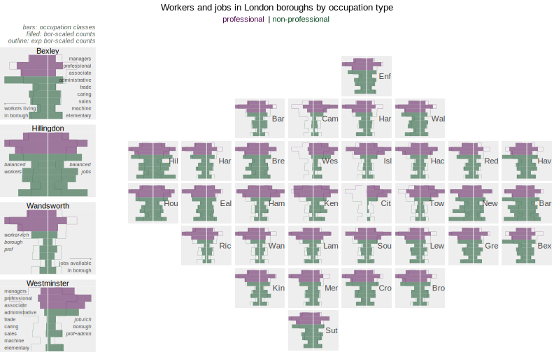

```{r, include = FALSE}
knitr::opts_chunk$set(
  fig.width = 8,
  fig.height = 5.25,
  collapse = TRUE,
  comment = "#>"
)
```


## Introduction

This vignette reproduces ideas discussed in [Beecham and Slingsby 2019](https://journals.sagepub.com/doi/10.1177/0308518X19850580), using ggplot2 to create gridmaps analysing the geography of travel-to-work between London boroughs.

## Setup

The following libraries are required to run this vignette:

```{r setup, message = FALSE, warning = FALSE}
library(ggplot2)
library(dplyr)
library(sf)
library(readr)
library(stringr)
library(forcats)
library(patchwork)
library(here)
library(ggtext)
library(tidyr)
library(gridmappr)

theme_set(theme_void())
```

## Data

The travel-to-work data contains origin-destination pairs representing every borough-to-borough commute combination: a `tibble` containing 9,801  observations and five variables:

* `o_bor` Borough origin.
* `d_bor` Borough destination. 
* `occ_type` Occupation type of commute: `1_managers_senior`, `2_professional`,  `3_associate_professional`, `4_administrative`, `5_trade`, `6_caring_leisure`, `7_sales_customer`, `8_machine_operatives`, `9_elementary`.
* `count` Count of number of commutes of occupation type between origin-destination borough pair.
* `is_prof` Whether the occupation type is professional or non-professional.


```{r data, message = FALSE, warning = FALSE, eval=FALSE}
london_ttw <- read_csv("london_ttw.csv")
```

To analyse commuting between London boroughs by occupation type we differentiate between:

* *jobs* located in a borough, accessed by workers living in London; and
* *workers* living in a borough, who access jobs in London

```{r jobs-workers, message = FALSE, warning = FALSE, eval=FALSE}
# Jobs located in borough.
jobs <- london_ttw |> 
  group_by(d_bor, occ_type) |> 
  summarise(count=sum(count), is_prof=first(is_prof), type="jobs") |> ungroup() |> 
  select(type, bor=d_bor, occ_type, is_prof, count)
# Workers living in borough.
workers <- london_ttw |> 
  group_by(o_bor, occ_type) |> 
  summarise(count=sum(count), is_prof=first(is_prof), type="workers") |> ungroup() |> 
  select(type, bor=o_bor, occ_type, is_prof, count)
```

## Generate allocation and make grid 

We use `points_to_grid()`, specified with targeted spacers, to get a solution close to the [LondonSquared](https://github.com/aftertheflood/londonsquared) layout. See the vignette [Generate gridmaps]() for a fuller explanation of `points_to_grid()` and `make_grid()`.


```{r, lb-spacers, eval=FALSE}
n_row <- 7
n_col <- 8
spacers <- list(
  c(1, 3), c(1, 5), c(1, 6),
  c(2, 2), c(2, 7),
  c(3, 1),
  c(6, 1), c(6, 2), c(6, 7), c(6, 8),
  c(7, 2), c(7, 3), c(7, 4), c(7, 6), c(7, 7)
)
pts <- london_boroughs |>
  st_drop_geometry() |>
  select(area_name, x = easting, y = northing)
solution <- points_to_grid(pts, n_row, n_col, compactness = 1, spacers)

gridmap <- make_grid(london_boroughs, n_row, n_col) |> 
  inner_join(solution)
```


## Gridmap as thematic map (`geom_sf`) 

Since we have created  simple feature object for the layout with `make_grid()`, it is straightforward to generate thematic gridmaps in ggplot2: using [`geom_sf()`](https://ggplot2.tidyverse.org/reference/ggsf.html) alongside ggplot2's standard `geom` layers and grammar. In the map below we encode counts of jobs and workers by borough as proportional symbols (with `geom_point()`) and `facet_grid()` the plot according to two categorical variables: occupation type (collapsed to *professional* or *non-professional*) and whether jobs or workers in the borough are counted over. 

```{r out.width = '100%', echo = FALSE}
knitr::include_graphics("img/lb-commutes.svg")
```

```{r, include=FALSE, eval=FALSE}
map_bubble <- gridmap |> 
  inner_join(bind_rows(jobs, workers), by=c("area_name"="bor")) |> 
  group_by(area_name, is_prof, type) |> 
  summarise(count=sum(count), x=first(x), y=first(y)) |> 
  mutate(
    is_prof=
      factor(if_else(is_prof, "professional", "non-professional"), 
             levels=c("professional", "non-professional")
      ),
    type=factor(type, levels=c("workers", "jobs"))
    ) |> 
  ggplot() +
  geom_sf(fill="#EEEEEE") +
  geom_point(aes(x = x, y = y, size=count, colour=is_prof),  alpha=.3) +
 geom_point(aes(x = x, y = y, size=count, colour=is_prof), fill="transparent", pch=21, stroke=.5) +
  facet_grid(is_prof~type) +
  scale_size(range=c(0,10))+
  scale_fill_manual(values=c("#4d004b", "#00441b"), guide="none") +
  scale_colour_manual(values=c("#4d004b", "#00441b"), guide="none") +
  scale_alpha(limits= c(min(jobs$count), max(jobs$count)), guide="none") +
  theme(legend.position="bottom")

map <- gridmap |> 
  ggplot() +
  geom_sf(fill="#EEEEEE") +
  geom_text(aes(x = x, y = y, label = str_extract(area_name, "^.{3}")), size = 2.8, alpha=.7) 

plot <- map_bubble + map + plot_layout(widths=c(.6,.4)) +
  plot_annotation(
    title="Workers and jobs in London boroughs by occupation type",
    subtitle= "<span style = 'color: #4d004b;'> professional  </span> | <span style = 'color: #00441b;'>non-professional </span>",
  theme=theme(
    plot.title=element_text(hjust = .5),
    plot.subtitle=ggtext::element_markdown(hjust = .5),
    )
  )

ggsave(filename = here("vignettes", "img", "lb-commutes.svg"), plot = plot, width = 8, height = 5)
```


```{r plot-jobs-workers, eval=FALSE}
gridmap |> 
  inner_join(bind_rows(jobs, workers), by=c("area_name"="bor")) |> 
  group_by(area_name, is_prof, type) |> 
  summarise(count=sum(count), x=first(x), y=first(y)) |> 
  mutate(
    is_prof=factor(if_else(is_prof, "professional", "non-professional"), levels=c("professional", "non-professional")),
    type=factor(type, levels=c("workers", "jobs"))
    ) |> 
  ggplot(aes(x = x, y = y)) +
  geom_sf(fill="#EEEEEE") +
  geom_point(aes(size=count, colour=is_prof),  alpha=.3) +
  geom_point(aes(size=count, colour=is_prof), fill="transparent", pch=21, stroke=.5) +
  facet_grid(is_prof~type) +
  scale_fill_manual(values=c("#4d004b", "#00441b"), guide="none") +
  scale_colour_manual(values=c("#4d004b", "#00441b"), guide="none") 
```


A quick explanation of the ggplot2 spec:

1. *Data*: Counts of workers and jobs (`type`) by borough, collapsed over *professional* or *non-professional* occupation types (`is_prof`). Casting `is_prof` and `type` to factor variables gives us control over the order in which they appear in the plot.
2. *Encoding*: the proportional symbols are positioned at the centroids of borough grid cells (`x`, `y`), sized according to `count` of jobs or workers and coloured according to occupation type (`is_prof`).
3. *Marks*: `geom_point()` for proportional symbols and `geom_sf()` for grid outline.
4. *Scale*: `scale_fill/colour_manual()` for hue-based associating occupation type and `scale_size()`for controlling size of points that encode counts.  
5. *Facets*: `facet_wrap()` on workers/jobs summary `type` and high-level occupation type (`is_prof`).

<!-- In the right column job-rich boroughs in central and inner London -- Westminster, City of London and Tower Hamlets (for professionals) --  can be identified. By contrast frequencies of workers living in boroughs, accessing jobs in any borough in London, tend to vary less, although the City of London is an exception. Notice also that there are larger numbers of professionals than non-professional workers living in inner west London boroughs (Wandsworth, Lambeth, Hammersmith, Kenisngton & Chelsea) and comparatively more non-professionals libing in outer London boroughs, easpecially to the east (Havering, Barking & Dagenham, Bexley). -->

## Gridmap as geographically-arranged `geoms` with `facet_grid`

It is straightforward with standard ggplot2 to allocate more detailed graphics into a geographic arrangement. In the example below are bar charts summarising the number of workers (left-pointing bars) and jobs (right-pointing bars) by occupation type, the full nine standard classes are shown, in each borough with a gridmap arrangement.

```{r out.width = '100%', echo = FALSE}

```

```{r plot-geoms, include=FALSE, eval=FALSE}
plot_data <- solution |> inner_join(bind_rows(jobs, workers), by=c("area_name"="bor")) |>
  group_by(area_name) |> 
  mutate(count=count/max(count)) |> ungroup() |> 
  group_by(type, occ_type) |> 
  mutate(mean=mean(count)) |> ungroup() |> 
  mutate(
      count=if_else(type=="jobs", count, -count),
      mean=if_else(type=="jobs", mean, -mean),
      occ_type=as.numeric(fct_rev(factor(occ_type))),
      ) 

legend <- plot_data |>
  filter(area_name %in% c("Wandsworth", "Westminster", "Bexley", "Hillingdon")) |> 
  ggplot(aes(x=occ_type, y=count)) + 
    geom_col(aes(fill=is_prof), alpha=.5, width=1) +
    # Compator : avg relative size per borough.
    geom_step(data= . %>% 
                group_by(area_name, type) %>%
                arrange(occ_type) %>%
                group_modify(~add_row(., .after=9 )) %>%
                mutate(
                  across(row:mean, ~if_else(is.na(.x), nth(.x,2), .x)),
                  occ_type=row_number()-.5,
                  is_prof=if_else(occ_type==9.5, TRUE, is_prof)
                  ),
              aes(x=occ_type, y=mean, group=type, colour=is_prof), alpha=.7, linewidth=.1,
              ) +
    geom_hline(yintercept=0, linewidth=.4, colour="#ffffff")+
  # Annotate occ types.
  geom_text(
      data= . %>% 
        filter(type=="jobs", area_name=="Westminster"),
      aes(x=occ_type, y=-1, label=word(str_replace_all(occ_type, "_", " "), 2)), fontface="plain",
      size=2.5, hjust=0, alpha=.7
      ) +
  geom_text(
      data= . %>% 
        filter(type=="jobs", area_name=="Bexley") %>% 
        mutate(is_admin=occ_type == "4_administrative"),
      aes(x=occ_type, y=1, label=word(str_replace_all(occ_type, "_", " "), 2), alpha=is_admin), alpha=.7, fontface="plain",
      size=2.5, hjust=1
      ) +
  facet_wrap(~area_name, scales="free", ncol=1) +
  # Annotate explanation
  geom_text(
    data= . %>% filter(type=="jobs", area_name=="Bexley", occ_type=="6_caring_leisure"),
    aes(x=1.5, y=-1), fontface="plain", label="workers living \nin borough",
    size=2.5, hjust=0, alpha=.7
    ) +
 geom_segment(
   data= . %>% filter(type=="jobs", area_name=="Bexley", occ_type=="6_caring_leisure"),
   aes(x = 2.6, y = -.5, xend = 2.6, yend = -1), linewidth=.1, arrow = arrow(length = unit(0.02, "npc"))
  ) +
  geom_text(
    data= . %>% filter(type=="jobs", area_name=="Wandsworth", occ_type=="5_trade"),
    aes(x=occ_type, y=-1), fontface="italic", label="worker-rich \nborough \nprof",
    size=2.5, hjust=0, alpha=.7
    ) +
  geom_text(
    data= . %>% filter(type=="jobs", area_name=="Hillingdon", occ_type=="6_caring_leisure"),
    aes(x=4.5, y=-1), fontface="italic", label="balanced \nworkers",
    size=2.5, hjust=0, alpha=.7
    ) + 
  geom_text(
    data= . %>% filter(type=="jobs", area_name=="Hillingdon", occ_type=="6_caring_leisure"),
    aes(x=4.5, y=1), fontface="italic", label="balanced \njobs",
    size=2.5, hjust=1, alpha=.7
    ) + 
  geom_text(
    data= . %>% filter(type=="jobs", area_name=="Westminster", occ_type=="6_caring_leisure"), 
    aes(x=occ_type, y=1), fontface="italic", label="job-rich \nborough \nprof+admin",
    size=2.5, hjust=1, alpha=.7
    ) + 
  geom_text(
    data= . %>% filter(type=="jobs", area_name=="Wandsworth", occ_type=="6_caring_leisure"), 
    aes(x=1.5, y=1), fontface="plain", label="jobs available \nin borough",
    size=2.5, hjust=1, alpha=.7
    ) +
  geom_segment(
   data= . %>% filter(type=="jobs", area_name=="Wandsworth", occ_type=="6_caring_leisure"),
   aes(x = 2.6, y = .5, xend = 2.6, yend = 1), linewidth=.1, arrow = arrow(length = unit(0.02, "npc"))
  ) +
  labs(subtitle="bars: occupation classes\nfilled: bor-scaled counts\noutline: exp bor-scaled counts") +
  scale_y_continuous(limits=c(-1,1)) + 
  scale_fill_manual(values=c("#00441b", "#4d004b"), guide="none") + 
  scale_colour_manual(values=c("#00441b", "#4d004b"), guide="none") + 
  coord_flip() + 
  theme(
    strip.text = element_text(size=11), panel.spacing=unit(0.5, "lines"),
    panel.background=element_rect(fill="#EEEEEE", linewidth = 0), 
    strip.background=element_rect(fill="#EEEEEE", linewidth = 0),
    plot.subtitle = element_text(size=9, colour="#636363", face="italic", margin=margin(t = 2, r = 0, b = 4, l = 0, unit = "pt"), hjust=1)
    )

map <- plot_data |> 
  ggplot(aes(x=occ_type, y=count)) + 
    geom_tile(aes(x=5, y=0), height=2, width=10, linewidth=0, fill="#EEEEEE") +
    geom_col(aes(fill=is_prof), alpha=.5, width=1) + 
    # Compator : avg relative size per borough.
    geom_step(data= . %>% 
                group_by(area_name, type) %>%
                arrange(occ_type) %>%
                group_modify(~add_row(., .after=9 )) %>%
                mutate(
                  across(row:mean, ~if_else(is.na(.x), nth(.x,2), .x)),
                  occ_type=row_number()-.5,
                  is_prof=if_else(occ_type==9.5, TRUE, is_prof)
                  ),
              aes(x=occ_type, y=mean, group=type, colour=is_prof), alpha=.7, linewidth=.1,
              ) +
    geom_hline(yintercept=0, linewidth=.4, colour="#ffffff")+
    geom_text(
      data= solution,
      aes(x=5, y=1, label=str_extract(area_name, "^.{3}")),
      size=4, alpha=.7, hjust=1
      ) +
  facet_grid(-row~col, scales="free") + 
  scale_y_continuous(limits=c(-1,1)) + 
  scale_fill_manual(values=c("#00441b", "#4d004b"), guide="none") + 
  scale_colour_manual(values=c("#00441b", "#4d004b"), guide="none") + 
  coord_flip() +   
  theme(
    strip.text = element_blank(), panel.spacing=-unit(0.1, "lines")
    )

plot <- legend + plot_spacer() + map +
  plot_layout(
    widths=c(.19,.06,.85)
    ) +
  plot_annotation(
    title="Workers and jobs in London boroughs by occupation type",
    subtitle= "<span style = 'color: #4d004b;'> professional  </span> | <span style = 'color: #00441b;'>non-professional </span>",
  theme=theme(
    plot.title=element_text(hjust = .5),
    plot.subtitle=ggtext::element_markdown(hjust = .5),
    )
  )

ggsave(filename = here("vignettes", "img", "lb-commutes-occ.svg"), plot = plot, width = 11, height = 7)
```

<!-- An advantage of gridmap layouts is that they free-up graphic space, thereby enabling potentially detailed charts to be shown with geographic context (e.g. [Beecham et al. 2021](https://www.mdpi.com/2220-9964/10/4/213)).  -->


This time we create a staged dataset for plotting(`plot_data`). In the graphic above, jobs and workers are differentiated by varying the direction of bars: pointing to the right for jobs, to the left for workers. This is achieved in data staging by a slight hack -- changing the polarity of counts by occupation depending on the summary `type`. The counts are further locally (borough-level) scaled. For each borough we find its modal category count of jobs/workers by occupation type and scale all other counts of jobs and workers by occupation type relative to this modal category. Doing so irrespective of whether jobs or workers are being summarised over, we can distinguish between job-rich boroughs with longer bars pointing to the right (Westminster); resident/worker-rich boroughs with longer bars pointing to the left (Wandsworth); and outer London boroughs that are more self-contained (Hillingdon). 

```{r bars-data, eval=FALSE}
# Combine jobs and workers summaries.
plot_data <- bind_rows(jobs, workers) |>
  # Borough-scaled counts (maximum).
  group_by(bor) |> 
  mutate(count=count/max(count)) |> ungroup() |> 
  # Selectively change sign and reverse factor for bars of descending occ status.
  mutate( count=if_else(type=="jobs", count, -count), occ_type=fct_rev(factor(occ_type)) )
```

The ggplot2 spec for creating the bar charts is:

```{r bars-spec, eval=FALSE}  
bor_select <- "Westminster"
plot_data  |> 
  filter(bor==bor_select) |> 
  ggplot() + 
    geom_col(aes(x=count, y=occ_type, fill=is_prof), alpha=.5, width=1) +
    geom_vline(xintercept=0, linewidth=.4, colour="#ffffff") +
    annotate("text", x=1, y=5, label=str_extract(bor_select, "^.{3}"), alpha=.7, hjust=1, size=4) +
  scale_x_continuous(limits=c(-1,1)) + 
  scale_fill_manual(values=c("#00441b", "#4d004b"), guide="none") 
```

1. *Data*: The staged (`plot_data`) object, filtered on *selected* boroughs for exploration purposes (identified with `bor_select`)
2. *Encoding*: Bars whose horizontal position (`x=`) varies according to `count` and vertical position (`y=`) according `occ_type`, filled on high-level (*professional* / *non-professional* -- `is_prof`) occupation type.
3. *Marks*: `geom_col()` for bars.
4. *Scale*: `scale_fill_manual()` for associating occupation type, `scale_x_continuous()` for making sure workers/jobs bars use the same scale. 
6. *Setting*: `annotate()` to provide a borough label within the plot space -- the middle right of the plot. We use `stringr::str_extract()` to pull out the first three letters of the borough name. ` 


Remembering that gridmap layouts created by `points_to_grid()` define *row* and *column* identifiers for each spatial unit in the original geography, it is easy to imagine how this can be turned into a gridmap using `ggplot2`'s built-in faceting. The only substantive update to the spec is that we supply `row` and `col` identifiers to `facet_grid()`, with a slight hack on the `col` variable as `gridmappr`'s origin [min-row, min-col] is the bottom-left cell in the grid whereas for `facet_grid()`  the origin is the top-left. Generating the graphic entirely with standard  (built-in) ggplot2 gives many options for plot customisation -- adding layers, annotations and other elements as in the example graphic.  

```{r bars-spec-grid, eval=FALSE} 
plot_data  |> 
  # Join on solution to IDs for gridmap layout.
  left_join(solution, by=c("bor"="area_name")) |> 
  ggplot() + 
    geom_col(aes(x=count, y=occ_type, fill=is_prof), alpha=.5, width=1) +
    geom_vline(xintercept=0, linewidth=.4, colour="#ffffff") +
    geom_text(data=solution, aes(x=1, y=5, label=str_extract(area_name, "^.{3}")), alpha=.7, hjust=1, size=4) +
  # Pass row col IDs from solution for gridmap layout.
  facet_grid(-row~col) +
  scale_x_continuous(limits=c(-1,1)) + 
  scale_fill_manual(values=c("#00441b", "#4d004b"), guide="none") +
  theme( strip.text = element_blank())
```

## Gridmap as geographically arranged `geom_sfs` (OD Maps)

So far we have generated gridmap graphics as standard thematic maps using a polygon object and `geom_sf()`; and as geographically arranged plot objects (glyphmaps) with `facet_grid()`. Combining both approaches -- placing standard thematic maps with a further geographical arrangement (using `facet_grid()`) -- allows the creation of [OD Maps](https://www.gicentre.net/featuredpapers#/woodvisualisation2010/). With this  map-within-map layout, we can look at flows of commuters *between* London boroughs. 

```{r, include=FALSE, eval=FALSE}
plot_data <- london_ttw |> 
  group_by(o_bor, d_bor, is_prof) |> 
  summarise(count=sum(count)) |> 
  pivot_wider(names_from = is_prof, values_from = count) |> 
  rename(non_prof = `FALSE`, prof = `TRUE`) |> ungroup() |> 
  mutate(global_prof=sum(prof)/sum(prof+non_prof))|> 
  group_by(d_bor) |> 
  mutate(count=prof+non_prof+.0001, obs=prof+.0001, exp=(global_prof*count), resid=(obs-exp)/(exp^.7)) |> ungroup() |> 
  left_join(gridmap |>  st_drop_geometry() |> select(area_name, d_col=col, d_row=row),by=c("d_bor"="area_name")) |> 
  left_join(gridmap |> select(o_x=x,o_y=y, area_name), by=c("o_bor"="area_name")) |> 
  mutate(
    bor_label=if_else(o_bor==d_bor,d_bor,""),
    bor_focus=o_bor==d_bor
  ) |> st_as_sf()
  
bbox_grid <- st_bbox(gridmap)
width <- bbox_grid$xmax-bbox_grid$xmin  
height <- bbox_grid$ymax-bbox_grid$ymin  

range_resid <- max(abs(plot_data$resid))

plot <- plot_data |> 
  ggplot()+
  geom_tile(data=. %>% filter(bor_focus), aes(x=bbox_grid$xmin+.5*width, y=bbox_grid$ymin+.5*height), height=height*1.02, width=width*1.02, linewidth=0, fill="#EEEEEE") +
  geom_sf(aes(fill=resid), colour="#616161", size=0.15, alpha=0.9)+
  geom_sf(data=.  %>% filter(bor_focus), fill="transparent",  colour="#373737", size=0.3)+
  geom_text(data=plot_data %>% filter(bor_focus), 
            aes(x=o_x, y=o_y, label=str_extract(o_bor, "^.{1}")), 
            colour="#252525", alpha=0.9, size=2.1,
            hjust="centre", vjust="middle")+
  geom_text(data=plot_data %>% filter(bor_focus), 
            aes(x=bbox_grid$xmax, y=bbox_grid$ymin, label=str_extract(o_bor, "^.{3}")), 
            colour="#252525", alpha=0.6, size=3.5,
            hjust="right", vjust="bottom")+
  coord_sf(crs=st_crs(plot_data), datum=NA)+
  #guides(fill=FALSE)+
  facet_grid(-d_row~d_col, shrink=FALSE)+
  scale_fill_distiller(palette="PRGn", direction=-1, breaks = c(-range_resid, 0, range_resid), labels = c("low prof", "avg", "high prof"), limits = c(-range_resid, range_resid)) +
  labs(
    fill="", 
    title="Commutes between London boroughs by occupation type",
    subtitle= "<span style = 'color: #4d004b;'> more professional  </span> | <span style = 'color: #00441b;'> more non-professional </span> <br>dark colour: large number commutes (+ diff from avg)") +
  theme(
    panel.spacing=unit(0.1, "lines"),
    strip.text.x = element_blank(), strip.text.y = element_blank(),
    plot.subtitle=element_markdown(hjust=.5, margin=margin(0,0,10,0)), plot.title=element_text(hjust=.5, margin=margin(0,0,2,0)),
    legend.position="bottom", legend.margin=margin(5,0,0,0),
    legend.key.size=unit(.5, 'cm')
  )

ggsave(filename = here("vignettes", "img", "lb-commutes-odmap.svg"), plot = plot, width = 10, height = 7)
```


```{r out.width = '100%', echo = FALSE}

```

Again we create a staged dataset (`plot_data`). Counts of commuter flows by occupation type (*professional* and *non-professional*) are calculated along with the proportion of jobs that are professional (51%, `global_prop`). If we were to randomly sample an OD (borough-borough) commute pair, we might expect this proportion to appear when counting up the number of *professional* and *non-professional* occupation types present in that commute. For each origin-destination pair (OD), we generate expected counts by multiplying the total number of commutes present in an OD pair by this `global_prop`, and from here signed residuals (`resid`), identifying whether there are greater or fewer professionals commuting that OD pair than would be expected. Note that these are like [signed chi-scores](https://www.tandfonline.com/doi/epdf/10.1179/caj.1981.18.1.32?needAccess=true) in that rather than expressing differences in observed counts as a straight proportion of expected counts (dividing by expected counts), we apply a power transform to the denominator. This has the effect of also giving saliency to differences that are large in absolute terms. You could try varying this exponent (maybe between 0.5-1.5) to see its effect on residuals encoded in the OD Maps.

```{r od-maps-data, eval=FALSE}
plot_data <- london_ttw |> 
  group_by(o_bor, d_bor, is_prof) |> 
  summarise(count=sum(count)) |> 
  pivot_wider(names_from = is_prof, values_from = count) |> 
  rename(non_prof = `FALSE`, prof = `TRUE`) |> ungroup() |> 
  mutate(global_prof=sum(prof)/sum(prof+non_prof))|> 
  group_by(d_bor) |> 
  mutate(
    count=prof+non_prof+.0001, 
    obs=prof+.0001, 
    exp=(global_prof*count), 
    resid=(obs-exp)/(exp^.7)
    ) |> ungroup() 
```


The ggplot2 spec for creating the OD map:

```{r, eval=FALSE}
bbox_grid <- st_bbox(gridmap)
width <- bbox_grid$xmax-bbox_grid$xmin  
height <- bbox_grid$ymax-bbox_grid$ymin  
range_resid <- max(abs(plot_data$resid))

plot <- plot_data |> 
  left_join(gridmap |>  st_drop_geometry() |> select(area_name, d_col=col, d_row=row),by=c("d_bor"="area_name")) |> 
  left_join(gridmap |> select(o_x=x,o_y=y, area_name), by=c("o_bor"="area_name")) |>
  mutate(
    bor_label=if_else(o_bor==d_bor,d_bor,""),
    bor_focus=o_bor==d_bor
  ) |> st_as_sf() |> 
  ggplot()+
  geom_sf(aes(fill=resid), colour="#616161", size=0.15, alpha=0.9)+
  geom_text(data=plot_data %>% filter(bor_focus), 
            aes(x=o_x, y=o_y, label=str_extract(o_bor, "^.{1}")), 
            colour="#252525", alpha=0.9, size=2.1,
            hjust="centre", vjust="middle")+
  geom_text(data=plot_data %>% filter(bor_focus), 
            aes(x=bbox_grid$xmax, y=bbox_grid$ymin, label=str_extract(o_bor, "^.{3}")), 
            colour="#252525", alpha=0.6, size=3.5,
            hjust="right", vjust="bottom")+
  coord_sf(crs=st_crs(plot_data), datum=NA)+
  facet_grid(-d_row~d_col, shrink=FALSE)+
  scale_fill_distiller(palette="PRGn", direction=-1, breaks = c(-range_resid, 0, range_resid), labels = c("low prof", "avg", "high prof"), limits = c(-range_resid, range_resid)) +
  theme(
    panel.spacing=unit(0.1, "lines"),
    strip.text.x = element_blank(), strip.text.y = element_blank(),
  )
```

* *1. Data*:
  + Take the staged dataset and join twice on the `gridmap` dataset.
  + The first join, on `d_bor`. The map in the figure is a D-OD map. The larger (*focus*) grid cells correspond to destinations; the smaller cells are origins coloured according to commuter flows  into the larger (focus) cells. When joining `plot_data` on destination (`d_bor`) we do not need the geometry data, so drop it, but we do need the cell IDs (`col`, `row`) to supply to the ggplot2 facet. Note that these variables are renamed in the `select()`.
  + The second join , on `o_bor`. As origins are the small maps, we retain  the `geometry` data as well as the geographic centroid of origin borough grid cells (`x`, `y`). Again these variables are renamed in the `select()`.
  + Finally in the `mutate()` we generate a new variable identifying the borough in focus (`bor_focus`), destination in this case, and a text label variable for annotating plots on this (`bor_label`).
* *2. Encoding*: 
  + Gridmap cells are coloured according to the calculated resdiuals (`fill=resid`). 
  + Text labels for destination (focus) boroughs are drawn in the bottom-right corner of larger cells. Note that the coordinate space here is that from the `gridmap` dataset and so the `x,y` location of borough labels are derived from the bounding box object (`bbox_grid`), calculated during data staging. Single letter annotations are also positioned where small origin cells match the focus (destination) borough. These additional labels are positioned using the grid centroids `o_x, o_y` from `plot_data`. 
* *3. Marks*: `geom_sf()` for drawing the small gridcell maps; `geom_text()` for drawing the labels.
* *4. Scale*: `scale_fill_distiller()` for a diverging colour scheme using the ColorBrewer `PRGn` palette and made symmetrical on 0 by manually setting `limits()`.
* *5. Facets*: `facet_grid()` for effecting the map-within-map layout.
